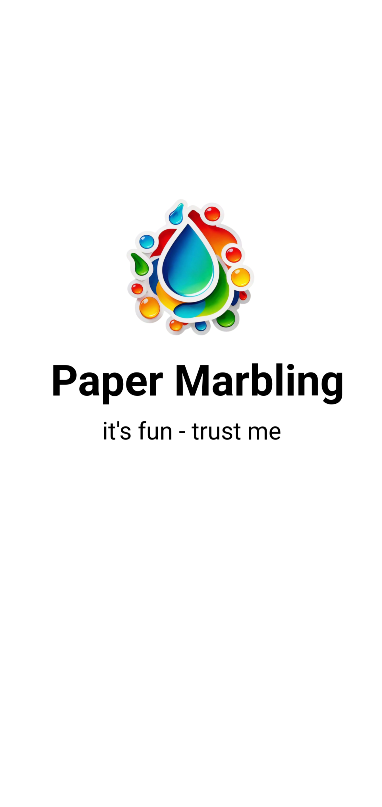
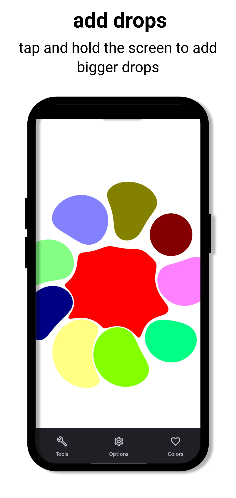
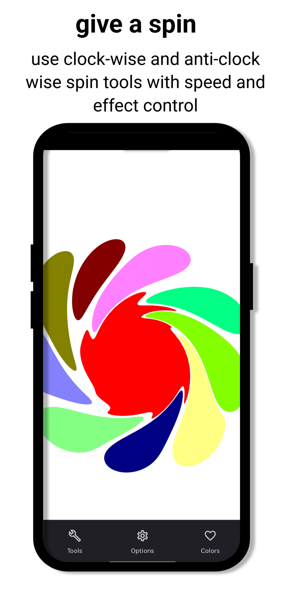
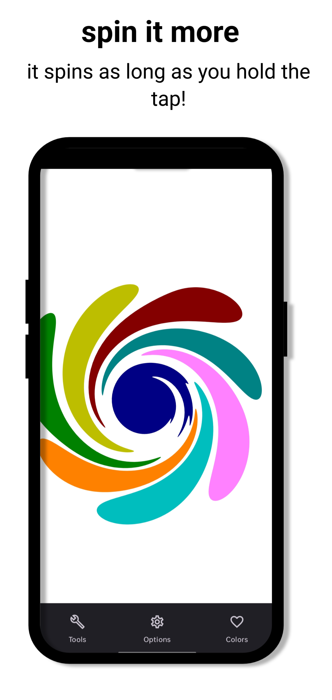
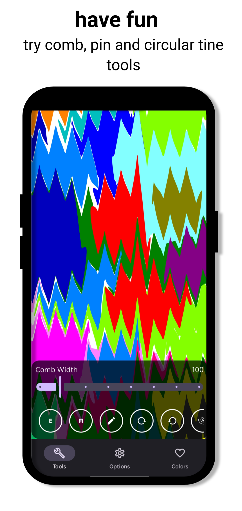

# Paper Marbling 🎨

**A fun and creative app for making mesmerizing marbling patterns with just a few swipes!**

## ✨ About
Paper Marbling is a digital art app that lets you create stunning marbled patterns. Inspired by traditional marbling techniques, this app provides a relaxing and creative way to generate unique swirling designs. Try different tools, play with colors, and unleash your inner artist!

## 📱 Features
- 🖌 **Multiple Tools** – Experiment with different brush styles and marbling techniques.
- 🎨 **Customizable Settings** – Adjust speed, radius, and comb width for unique effects.
- 💾 **Save Your Art** – Capture your masterpiece and share it with friends.
- 🚀 **Smooth & Responsive UI** – Designed for an intuitive and fun user experience.

## 📸 Screenshots

  
  
  
  
  
  

## 🔗 Download
**Get the app on Google Play:** 

[Paper Marbling Android](https://play.google.com/store/apps/details?id=com.meancoder.papermarbeling) 

## 💻 Tech Stack
- **Android (Jetpack Compose)** – For a modern UI experience.
- **Kotlin** – Primary language for development.
- **Canvas & Custom Rendering** – To achieve fluid and dynamic marbling effects.

## 📜 License
This project is licensed under the MIT License. See the [LICENSE](LICENSE) file for details.

## 🤝 Contributing
Contributions are welcome! Feel free to fork the repository and submit a pull request with improvements or new features.

## 📢 Stay Connected
- **LinkedIn:** [Your Profile Link]

Enjoy marbling! 🌀

